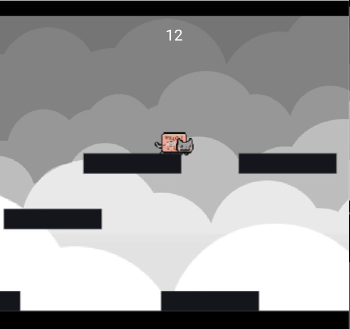

# Neko Jump

A Game Power by React and Matter.js



## Dev

```markdown
### `yarn start`

Runs the app in the development mode. Open [http://localhost:3000](http://localhost:3000) to view it in the browser.

### `yarn build`

Builds the app for production to the `build` folder. It correctly bundles React in production mode and optimizes the build for the best performance.

```

## Licence

MIT
